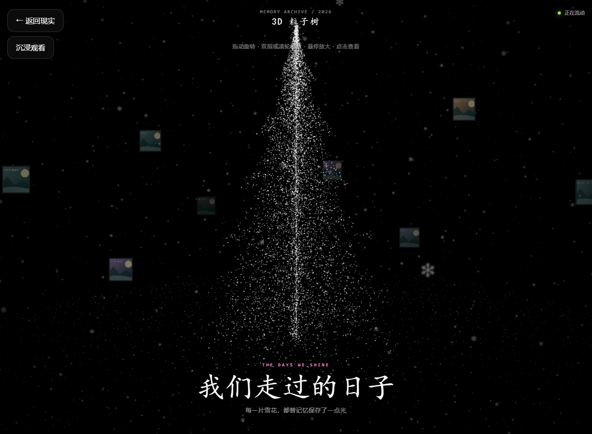

# Memory Archive / 我的记忆档案

把照片、视频与文字放进带有 **3D 粒子树、漂浮相框、雪花、音乐和桌宠** 的记忆网站。提供网页后台和原生安卓管理 App，可在自己的 VPS 独立运行。

## 🚀 一键安装网站：复制到自己的 VPS 终端执行

> **准备自己的 VPS 和域名。** 域名指向 VPS，开放 80/443。自动安装支持 Debian / Ubuntu，建议 2 核、2 GB 内存。用 SSH 以 root 登录 VPS 后，复制整行命令执行；普通账号需将最后的 bash 改为 sudo bash。

```bash
curl -fsSL https://raw.githubusercontent.com/jack-114514/into-youth-archive/main/install.sh -o /tmp/memory-archive-install.sh && bash /tmp/memory-archive-install.sh
```

**填自己的域名、邮箱、管理员密码 → 等待构建 → 打开 `https://你的域名`。后台：`https://你的域名/admin`。** Turnstile 和邮件恢复可先跳过，稍后配置。

**[📖 第一次建站？点这里看逐步安装指南](docs/QUICK_START.md)** · **[查看/下载网站安装脚本](https://raw.githubusercontent.com/jack-114514/into-youth-archive/main/install.sh)**

链接用于查看/下载脚本；安装命令要在 VPS 的 Linux 终端执行。没有 curl 或 sudo 时，见[常见问题](docs/QUICK_START.md#常见问题)。已有 Docker 需支持 Compose v2。

## 📱 安卓管理 App：点这里直接下载

### [⬇ 下载安卓 APK · 通用自建版预览包](https://github.com/jack-114514/into-youth-archive/releases/download/v3.0.0/memory-archive-admin-preview.apk)

**Android 7.0 及以上。安装后填写自己的 HTTPS 域名，再用自己的后台账号登录；不用改源码或重编译 APK。**

[发行版与校验文件](https://github.com/jack-114514/into-youth-archive/releases/latest) · [安卓功能 / 技术 / 构建](mobile-admin-app/README.md) · **[安卓隐私政策](mobile-admin-app/PRIVACY.md)**

这是测试签名预览包；长期分发请用自己的稳定签名构建 release。不同测试构建可能需要卸载后重装，卸载只清除手机端配置，不清除 VPS 数据。旧 v1.0.0 APK 是固定站点版本，请选择此处的通用自建版。

---

## 文档入口

| 想做什么 | 去哪里 |
| --- | --- |
| 第一次安装、换域名、配置自己的 Cloudflare | [新手安装与配置](docs/QUICK_START.md) |
| 看前台和后台完整功能，下载纯文本清单 | **[网站功能详情.txt](docs/网站功能详情.txt)** · [直接打开纯文本](https://raw.githubusercontent.com/jack-114514/into-youth-archive/main/docs/网站功能详情.txt) |
| 查技术、目录、接口、数据与开发方式 | [技术说明](docs/TECHNICAL.md) |
| 备份、更新、回滚、非 Docker 部署 | [自建运维说明](docs/SELF_HOSTING.md) |
| 手机管理自己的站点 | [安卓说明](mobile-admin-app/README.md) · [隐私政策](mobile-admin-app/PRIVACY.md) |

## 当前版本与独立性

| 项目 | 当前版本 |
| --- | --- |
| 网站自建发行版 | v3.0.0，前台 + 网页后台 + Python API + 安装运维脚本 |
| 安卓通用管理 App | 1.1.0，versionCode 2；应用 ID `org.memoryarchive.admin` |
| 默认部署 | Docker Compose + Caddy HTTPS + SQLite；单站点、单管理员 |

新装网站保留整套界面、动画与功能，使用中性文案和生成的演示插画。数据库、账号、照片、域名、Cloudflare、邮箱和 AI 密钥由安装者自行配置。源码不含原作者的真实照片、数据库、上传内容、服务器地址、密码、云服务凭据或安卓签名私钥；运行时不连接原作者的网站。

安装和更新会访问所选 GitHub 仓库、依赖源与镜像服务。运行中的第三方服务按自己的配置启用。开源许可与第三方素材署名仍须保留。

<details>
<summary>查看自建版 3D 粒子树演示截图（生成插画）</summary>



</details>

## 前台：访客能看到和使用什么

| 页面 / 功能 | 展示与交互 |
| --- | --- |
| 欢迎开场 | 独立开场图、加载与进入动画；访客可设置本机保存的昵称、头像 |
| 首页 | 标题、简介、照片/视频卡片、栏目入口、个人介绍与页脚；适配桌面和手机 |
| 3D 粒子树 `/memory` | 粒子树、漂浮照片、雪花/星空持续动画；拖动旋转、滚轮/双指缩放、悬停放大、点击查看、沉浸观看 |
| 图片与视频查看 | 原比例图片、详情文字、全屏看图、视频播放；解码预热和有限缓存，保留场景动画 |
| 故事集 `/stories` | 图文/视频记忆、标题、描述、日期；点击图片看原图 |
| 时间线 `/timeline` | 按配置事件展示日期与文字，记录自己的经历 |
| 校园碎片 `/campus`、随手记 `/notes`、关于 `/about` | 独立内容栏目、图片、简介；展示文案由站长编辑 |
| 留言板 `/messages` | 昵称、头像、文字/图片留言、回复、点赞；站长可隐藏或删除 |
| 投稿 | 提交标题、正文、图片、联系邮箱，进入站长审核列表 |
| 音乐 | 自建播放列表、播放/暂停、音量与播放顺序、音量渐变；自动播放受浏览器限制 |
| Live2D 桌宠 | Haru / Miku 示例或自己的授权模型；拖动、移动、鼠标跟随、互动台词；可选 AI 对话 |

## 网页后台：站长能自定义什么

打开 `/admin`，用安装时设置的邮箱和密码登录。

| 管理区域 | 可编辑内容 |
| --- | --- |
| 网站品牌 | 名称、Logo/图标、主标题、简介、文字、字号/字重、颜色、页脚、自己的 GitHub / 邮箱联系链接 |
| 首页布局 | 卡片顺序、栏目显示开关、图片/视频、裁剪/比例、展示大小、背景模糊与色调 |
| 欢迎开场 | 桌面/手机开场图、裁剪、亮度/模糊、水印、加载时长、节点与进入按钮 |
| 媒体与故事 | 上传图片/视频、标题、描述、日期、排序；分别控制首页、3D、故事集显示；编辑和删除条目 |
| 3D 场景 | 雪花环绕 / 飘雪 / 宇宙等预设；粒子密度、亮度、树形生长、照片大小/分布/边框等参数 |
| 文字栏目 | 时间线事件、个人介绍、关于页图片及各栏目文案 |
| 音乐 | 上传音频、播放列表、默认播放设置、音量、随机/顺序/单曲循环 |
| 桌宠 | 模型、尺寸/位置、移动与互动参数、情绪/台词、自己的 DeepSeek 配置；AI 默认关闭 |
| 留言 / 投稿 | 查看内容；隐藏/显示/删除留言；接受/拒绝投稿、删除投稿记录 |
| 账号与统计 | 访问与内容统计；网页邮箱验证恢复/修改密码需先配置自己的 Turnstile 与 SMTP |

安卓端提供媒体、留言、投稿、统计和部分文字设置管理；精细排版、开场、3D、音乐、桌宠配置使用网页后台。[查看安卓功能覆盖表](mobile-admin-app/README.md#功能覆盖)。

## 技术栈：实际运行方式

| 层 | 技术与用途 |
| --- | --- |
| 网页界面 | React 19.2.6、TypeScript 5.9.3、Vite 8.0.13；VPS 部署为静态 SPA |
| 3D | Three.js 0.185.x、React Three Fiber 9.x、Drei 10.x；WebGL 场景 |
| 动画与样式 | Framer Motion 13.x、Tailwind CSS 4.2.1、自定义 CSS、Lucide 图标 |
| 裁剪 / 桌宠 | react-advanced-cropper；PixiJS 6.5.10 + pixi-live2d-display 0.4.0 + Cubism Core |
| 后端 | Python 标准库 HTTP 服务、JSON API、SQLite；无需额外 Python Web 框架或数据库服务 |
| 网站部署 | Docker Compose v2；Node 22 构建、Python 3.12 容器、Caddy 2 HTTPS/反向代理 |
| Android | Flutter 3.47.0 / Dart 3.13、Material 3、Riverpod、Dio、安全存储和手机端媒体压缩 |
| 可选服务 | 自己的 Cloudflare DNS / Turnstile、SMTP、DeepSeek |
| 持续验证 | GitHub Actions：网页/后端检查、全新容器安装/备份、Flutter 分析/测试/APK 构建 |

详细版本、接口和数据流见[技术说明](docs/TECHNICAL.md)。依赖文件保留部分历史开发工具，默认 VPS 运行路径不依赖 Next SSR、Cloudflare Workers / D1 或 Drizzle ORM。

## 日常维护

```bash
cd /opt/memory-archive
sudo bash scripts/backup.sh
```

```bash
cd /opt/memory-archive
sudo bash scripts/update.sh
```

更新先备份，再拉取自己仓库的 `origin/main` 并构建；失败回退代码与镜像，保留当前数据。备份含数据库、上传文件、私密配置，应另存站外。[维护与恢复](docs/SELF_HOSTING.md)。

## 开源许可

主要程序采用 [MIT](LICENSE)。[登录组件许可](components/opensource-login/LICENSE)、[第三方素材说明](public/THIRD_PARTY_NOTICES.txt)及 [Live2D 模型说明](public/assets/desktop-pet/NOTICE.txt)分别适用；角色模型和 Cubism Core 不由项目 MIT 许可覆盖。使用自己的内容与授权模型时，请保留对应许可。

## v3.1.1 更新

原创墨灵：六部件透明图集、14表情、12动作、3组拖拽互动、只用眼睛跟随鼠标、挥手告别后休息。AI 默认输出上限 5000，后台最高 10000；异常 JSON 回复自动补试一次。每个签名访客会话独立限流：每分钟20次、每10分钟60次，超额休息5分钟且不调用API。共享IP不会合并访客额度。清除Cookie或跨设备属于新会话，不能识别同一个自然人。

通用安卓管理 App 1.2.1+4 新增原生助手设置：名称、形象、说话风格、大尺寸人设编辑、输出上限、模型、新Key、帧率和互动开关。保存只修改这些字段，保留其他台词和布局参数。墨灵动画仍在电脑网页运行，安卓端负责管理。新安装默认墨灵；旧安装已保存的角色、人设和Key保持原值。
